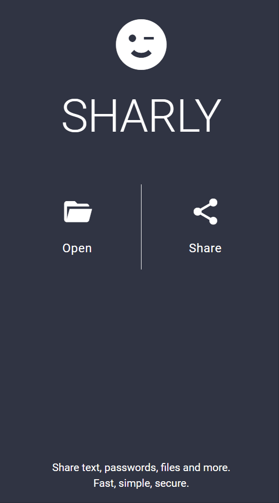

# SHARLY

Hi, my name is Sharly. Share secret text, passwords and files with me and will store them safely on your server. Your files will be secured by a randomly generated token which you can share with other peoples. With that token, they can gain acess to your shared resources. After the token expires, I will remove everything you shared with me from your server.



## Installation
You need to install docker (and docker-compose) to startup the services.   
1. Currently, there is no imaged published to docker hub. You need to clone this repository:

	```bash
	git clone https://github.com/wehrstedt/sharly.git
	```

2. Replace the following environment variables with something secure:
   * `MONGO_INITDB_ROOT_USERNAME` root user name for mongodb
   * `MONGO_INITDB_ROOT_PASSWORD` password of the root user
   * `DB_USER` username of the mongo db which the sharly should use to connect to mongo db
   * `DB_PASSWD` Password for the mongo db user
   * `SHARLY_PASSWD` Password which is neccessary for uploading content. This prevents that random people can upload content to your (maybe publicly available) sharly instance.

3. Run `docker-compose up -d --build` to start the services.

By default, sharly will be available at Port 80. It uses a nginx server to provide the frontend.

# Contribute
There are no contribution guidlines. I developed this project just for my needs. If you are missing something, feel free to create a PR. 
